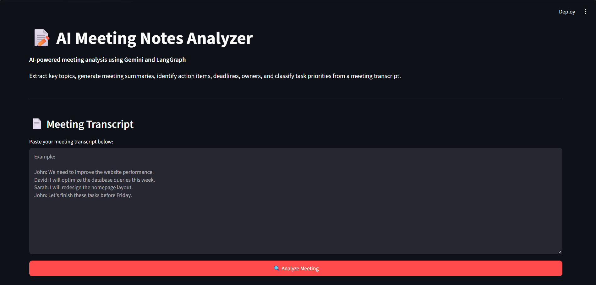
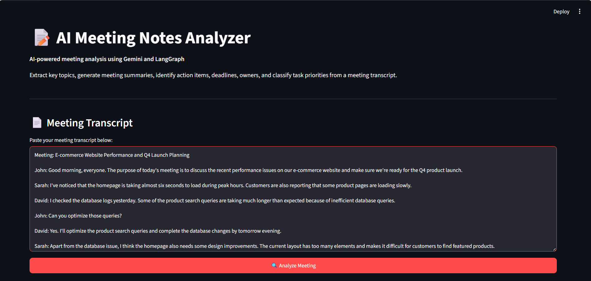
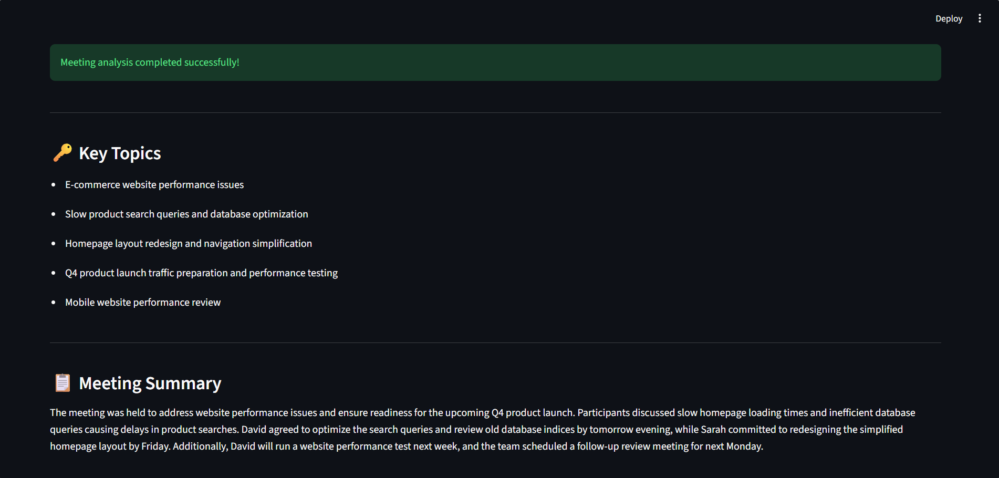
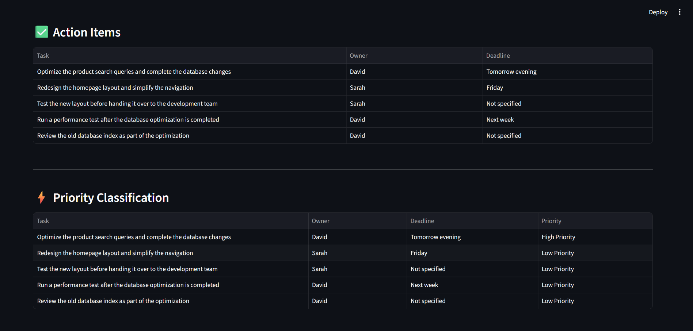
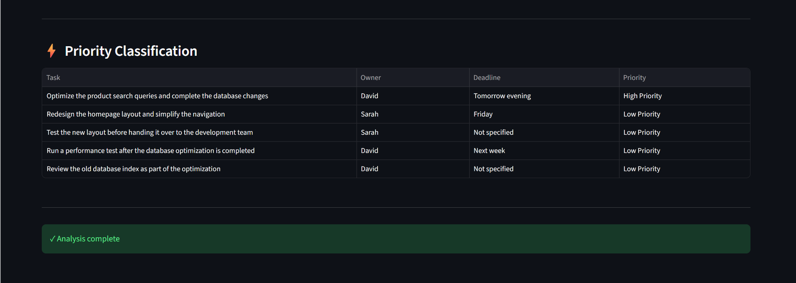

# 📝 AI Meeting Notes Analyzer




An AI-powered meeting analysis application built using **Google Gemini, LangGraph, and Streamlit**.

The application takes a meeting transcript as input and automatically analyzes it to extract important information such as **key topics, meeting summary, action items, task owners, deadlines, and task priorities**.

---

## 📌 Project Overview

In meetings, important decisions, responsibilities, and deadlines are often scattered throughout lengthy discussions. Manually reviewing meeting transcripts can be time-consuming and may result in important action items being missed.

The **AI Meeting Notes Analyzer** automates this process using Generative AI and an Agentic AI workflow.

The user provides a meeting transcript, and the application processes it through multiple specialized agents using **LangGraph**.

The final results are displayed through an interactive **Streamlit interface**.

---

## 🎯 Objectives

The main objectives of this project are:

- Extract important topics from a meeting transcript
- Generate a concise meeting summary
- Identify actionable tasks
- Identify the person responsible for each task
- Extract deadlines associated with action items
- Classify the priority of action items
- Handle meetings where no action items are identified
- Present the analysis through an easy-to-use Streamlit interface

---

## 🚀 Key Features

### 🔑 Key Topic Extraction

Identifies the major topics discussed during the meeting.

Example:

```text
- Website performance improvement
- Database optimization
- Homepage redesign
```
## 📋 Meeting Summary

Generates a concise summary covering the main purpose and important discussion points of the meeting.

### ✅ Action Item Extraction

Identifies explicit actionable tasks from the meeting.

For each task, the application extracts:

Task
Owner
Deadline

Example:
| Task                      | Owner | Deadline         |
| ------------------------- | ----- | ---------------- |
| Optimize database queries | David | Tomorrow evening |
| Redesign homepage layout  | Sarah | Friday           |

### ⚡ Priority Classification

Classifies identified action items according to their priority.

Example:
| Task                      | Owner | Deadline         | Priority      |
| ------------------------- | ----- | ---------------- | ------------- |
| Optimize database queries | David | Tomorrow evening | High Priority |
| Redesign homepage layout  | Sarah | Friday           | Low Priority  |

### 🔄 Conditional Workflow

The application also handles meetings where no genuine action items are identified.

If no action items are found, the workflow avoids unnecessary priority classification.

## 🤖 Generative AI & Agentic AI

This project uses Google Gemini as the Generative AI model.

The project does not use OpenAI models.

Different stages of meeting analysis are handled through specialized agents, with LangGraph coordinating the workflow.

The workflow can be represented as:
```
                  Meeting Transcript
                         │
                         ▼
                ┌─────────────────┐
                │  Topic Agent    │
                └────────┬────────┘
                         │
                         ▼
                ┌─────────────────┐
                │ Summary Agent   │
                └────────┬────────┘
                         │
                         ▼
                ┌─────────────────────┐
                │ Action Item Agent   │
                └──────────┬──────────┘
                           │
                           ▼
                  Action Items Found?
                     /           \
                   Yes            No
                   │               │
                   ▼               ▼
          ┌────────────────┐   End Workflow
          │ Priority Agent │
          └───────┬────────┘
                  │
                  ▼
            Final Analysis
                  │
                  ▼
           Streamlit Interface
```

## Technologies Used

| Technology    | Purpose                         |
| ------------- | ------------------------------- |
| Python        | Application development         |
| Google Gemini | Generative AI model             |
| LangGraph     | Agentic workflow orchestration  |
| Streamlit     | Web application interface       |
| Pandas        | Tabular presentation of results |
| python-dotenv | Environment variable management |


## Project Structure
```
AI_Meeting_Notes_Analyzer/
│
├── app.py
├── agents.py
├── graph.py
├── state.py
│
├── requirements.txt
├── README.md
└── .gitignore
```
#### app.py

Contains the Streamlit application and user interface.

It accepts the meeting transcript and displays:

* Key Topics
* Meeting Summary
* Action Items
* Owners
* Deadlines
* Priority Classification
* agents.py

Contains the AI agents responsible for the different meeting analysis tasks.

### state.py

Defines the shared state used throughout the LangGraph workflow.

### graph.py

Defines and connects the LangGraph workflow and controls the flow between the different agents.

### requirements.txt

Contains the Python libraries required to run the project.

## 🔐 Gemini API Configuration

This project uses the Google Gemini API.

Create a .env file in the project directory:
```
GEMINI_API_KEY="your_gemini_api_key"
```
Replaced

your_gemini_api_key

with Gemini API key.

Important

The .env file should not be uploaded to GitHub.

The API key should always remain private.

## ▶️ Running the Application

After activating the virtual environment, run:
```
streamlit run app.py
```
The Streamlit application will open in your browser.

## 🖥️ Application Workflow
#### Step 1 — Enter Meeting Transcript

Paste the meeting transcript into the Streamlit text area.

Example:



#### Step 2 — Analyze Meeting

Click:
```
🔍 Analyze Meeting
```
#### Step 3 — View Results

The application generates:
```
Key Topics
     ↓
Meeting Summary
     ↓
Action Items
     ↓
Owners & Deadlines
     ↓
Priority Classification
```

## 📊 Example Output









## 🛠️ Agentic Workflow

The project demonstrates an agent-based approach to meeting analysis.

### 1. Topic Extraction Agent

Analyzes the transcript and extracts the major topics discussed.

### 2. Summary Agent

Generates a concise summary of the meeting.

### 3. Action Item Agent

Identifies explicit actionable tasks and extracts:

Task
Owner
Deadline
### 4. Priority Agent

Classifies the identified action items according to their priority.

### 5. LangGraph Workflow

LangGraph coordinates the agents and controls the flow of information between them.

A conditional workflow is also used so that priority classification is performed only when genuine action items are available.

## 🔒 Security

The Gemini API key is stored in an environment variable rather than directly in the source code.

## 👩‍💻 Project

### AI Meeting Notes Analyzer

Built using:

### Python | Google Gemini | LangGraph | Streamlit | Pandas
